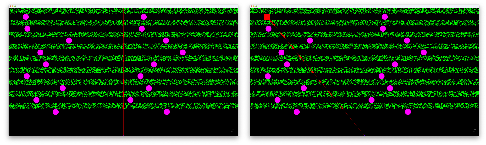

# SwingHitTest
A simple test of "lines bound checking" for hit detection

This is some test ideas based on https://stackoverflow.com/questions/71520142/java-swing-somewhat-efficient-getting-what-sprites-run-under-a-line#comment126440717_71520142

The intention is to test the performance of hit detection of multiple moving and static targets through the use of a simple "line of sight" concept.  The example managers 15k entities and makes of a Swing `Timer` set to a 5 millisecond repeat.  It then attempts to keep track of the number of "sighted" entities and the estimated frame rate.  The purpose is to attempt to determine if there are any significant performance degragations in performing the hit test.

**This is unoptimised** and makes use of the standard Swing paint pipeline, so no "magic" or `BufferStratgey`

In most of my testing, I get frame rates in excess of 100fps with a highend framerate of roughly 180+fps.  If I remove painting the hit targets, the frame rate goes up - maybe something worth investigating.
